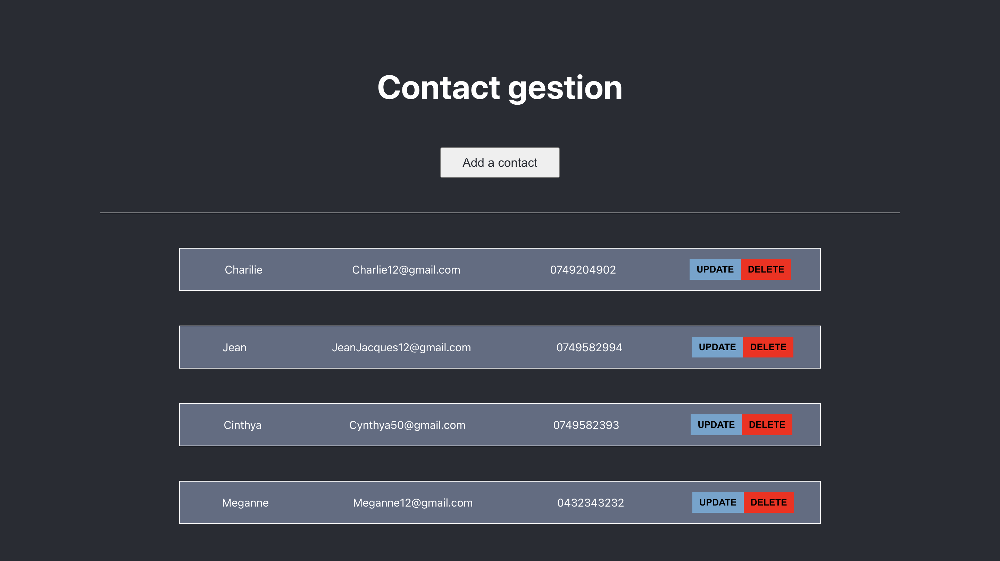

### Bienvenue sur l'application Contact gestion 📞😃
| Cette application permet de pouvoir enregistrer ses contactes sur le web.

### Suivez les instructions pour lancer le projet

### 1) Clonnez le projet

`git clone  .`
 

### 2) Lancer Backend

1. Aller dans le back
   -> `cd backend`

2. Installer les dépendances
   -> `npm install`

3. Lancer le backend
   -> `npm start`

### 3) Lancer Frontend

1. Aller dans le front
   -> `cd frontend`

2. Installer les dépendances
   -> `npm install`

3. Lancer le frontend
   -> `npm start`

### Bonne visite sur Contact gestion 👍
